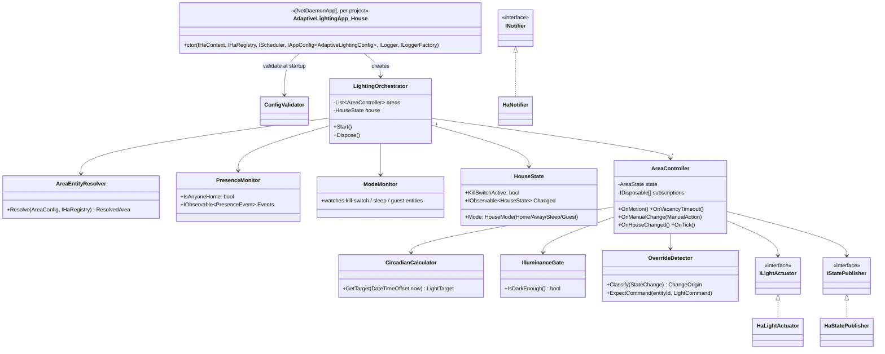

Namespace root: `AdaptiveLighting`. All engine code lives in **`AdaptiveLighting/`**; `House` and
`Cabin` carry only a bootstrap app + a YAML file each. Tabs for indentation in all
hand-written code. New files only — nothing existing is refactored; the old apps are disabled by
commenting out `[NetDaemonApp]` (established idiom, see `House/apps/LightAutomation/Template.cs`).

## 0. Two verified facts that shape the whole design

1. **One `[NetDaemonApp]` class = exactly one instance.** Verified in
   `NetDaemon.AppModel/Internal/AppModelContext.cs`: one `IAppFactory` per discovered class, one
   `Application` per factory. The "instancing" docs page
   (`docs/user/app_model/instancing_apps.md`, read from source) documents *only* `IAppConfig<T>`
   injection — there is **no** per-YAML-block multi-instancing in the current app model. **This
   contradicts the task prompt ("one app instance per area") and the `netdaemon` skill ("Each
   YAML block instancing the config yields a separate app instance") — both are wrong.**
   Consequence: one orchestrator app per host, fanning out internally to one controller object
   per area. (This is also simply better: shared presence/mode state, one registry snapshot, one
   config document.)
2. **`AddAppsFromAssembly(Assembly.GetExecutingAssembly())`** in both `program.cs` files scans
   only the host assembly. Classes in `AdaptiveLighting` marked `[NetDaemonApp]` are **never instantiated**
   (today's `Common/Extensions/EntityManager.cs` `EntityManagerTest` is dead code — see disable
   list). Consequence: engine classes in AdaptiveLighting carry **no** `[NetDaemonApp]`; the per-project
   bootstrap is the composition root. No `program.cs` change is needed for the engine.

## 1. The AdaptiveLighting-vs-per-project seam (the crux)

The generated types (`Entities`, `LightEntity`, `BinarySensorEntity`, everything in
`HomeAssistantGenerated.cs`) exist per project and can never move to `AdaptiveLighting` — this is why
`ButtonIsClicked` is stuck in `Cabin/apps/Extensions/EntityExtensionsLocal.cs`.

The engine therefore **never touches a generated type**. It is written entirely against types
that ship in the `NetDaemon.HassModel` package, which `AdaptiveLighting` already references and which are
**interfaces or plain records — all fakeable**:

- `IHaContext` — untyped `Entity(string)`, `GetAllEntities()`, `StateAllChanges()`,
  `GetState(id)`, `CallService(domain, service, target, data)`, `SendEvent(...)` [verified
  interface surface]
- `IHaRegistry` — `Areas`, `Floors`, `Labels`, `GetArea(id)`; `Area.Entities`
  (direct + via device), `Area.Floor`, `EntityRegistration.Labels/Area/Options` [verified]
- `System.Reactive.Concurrency.IScheduler` — already injectable (proof:
  `LightAutomationTest` ctor receives one today); `TestScheduler` drives it in tests
- `EntityState.Context` (`Id`/`ParentId`/`UserId`) for override detection [verified]

On top of those, the engine defines **three narrow seams of its own** so unit tests never need a
full `IHaContext` fake for the interesting logic:

```
ILightActuator      void Apply(string entityId, LightCommand cmd)         // wraps light.turn_on/off
IStatePublisher     void Publish(AreaSnapshot snapshot)                    // observability, no-op-able
INotifier           void Notify(string title, string message)              // persistent_notification
```

Default implementations (in AdaptiveLighting) delegate to `IHaContext`. **Nothing per-project implements
anything** — the per-project payload is exactly: (a) the `[NetDaemonApp]` bootstrap class, (b) the
YAML config, (c) the generated file + appsettings that were already there. If a future feature
genuinely needs a typed generated entity, the bootstrap passes a delegate/adapter down — the
seam is already shaped for it (constructor injection of the interfaces above).

## 2. Component diagram



## 3. Responsibilities per class

All in `AdaptiveLighting/`, namespace shown per class. Every subscription in the engine uses
**`SubscribeSafe`** (never bare `Subscribe`), and every timer goes through the injected
`IScheduler` (never `Task.Delay`/`System.Timers`).

### `AdaptiveLighting.Engine`

| Class | Responsibility |
|---|---|
| `LightingOrchestrator` | Composition root of the engine (plain class, `IDisposable`). Builds `HouseState`, `PresenceMonitor`, `ModeMonitor`, resolves each configured area via `AreaEntityResolver`, creates one `AreaController` per resolved area, wires the house-changed stream to all areas. On dispose, disposes everything (needed for config hot-reload, Part 4). Skips (with `INotifier` + log) areas that fail resolution — one bad area must not kill the engine. |
| `AreaController` | The per-area state machine (see §5). Subscribes to: motion sensors (`StateChanges` on each sensor entity id via `IHaContext.Entity(id)`), light entity `StateAllChanges` (feeding `OverrideDetector`), lux sensor changes, a periodic circadian tick (`IScheduler`, default every 60 s), and `HouseState.Changed`. All state mutation happens inside `lock (_gate)` — Rx callbacks and scheduler callbacks may interleave. Vacancy timeout is implemented with `IScheduler.Schedule` returning a disposable that is replaced on every motion event (do **not** use `WhenStateIsFor` here: multiple sensors per area must merge, and the timeout must also restart on manual interaction). |
| `HouseState` | Immutable snapshot record (`Mode`, `KillSwitchActive`, `IsAnyoneHome`) + a `BehaviorSubject`-backed `Changed` observable owned by the orchestrator. |
| `PresenceMonitor` | Watches configured `person.*`/`device_tracker.*` entities (`state == "home"`). Emits `EveryoneLeft` (debounced by `AwayDebounceMinutes` via `IScheduler`) and `FirstPersonArrived`. |
| `ModeMonitor` | Watches the configured kill-switch / sleep / guest entities (any on/off-ish domain: `input_boolean`, `switch`, `binary_sensor`). Missing config → that mode is permanently inactive (no error). |
| `OverrideDetector` | Two mechanisms, combined: **(1) command-expectation correlation** — before every `ILightActuator.Apply`, the controller calls `ExpectCommand(entityId, cmd)`; any state change on that entity arriving within `SelfEchoWindowSeconds` (default 8) that is consistent with the expectation is classified `Self`. **(2) context inspection** — `Context.UserId == cfg.NetDaemonUserId` → `Self`; `UserId == null && ParentId == null` → `PhysicalDevice` (wall switch, dimmer, Zigbee remote acting directly); `UserId` = anything else → `HaUser` (app/UI); `ParentId != null` → `Automation`. `PhysicalDevice` and `HaUser` are manual; `Automation` counts as manual when `TreatAutomationsAsManual: true` (default). Honest limitation, stated: `CallService` is fire-and-forget and does not return the created context id [verified `IHaContext`], so exact context matching is impossible — that is *why* both heuristics exist; expectation-correlation is primary, `NetDaemonUserId` is an optional belt-and-braces config value. |
| `IlluminanceGate` | `IsDarkEnough()` = the area's lux below `LuxThreshold` (with `LuxHysteresis` so 999↔1001 flapping doesn't strobe). Several sensors are averaged geometrically, dead and stale ones dropped. **No lux sensor at all is simply dark** — a gate with nothing to read refuses nothing — whereas a sensor that exists and will not read falls back to sun elevation below `SunElevationThreshold` (`sun.sun` attribute `elevation`). Config chooses `Lux`, `Sun`, `Either`, `Always` per area. |
| `CircadianCalculator` | Pure function of (config periods, now). Resolves the active `TimePeriod` (fixed `HH:mm` or sun-event ± offset boundaries), returns `LightTarget` (brightness %, color-temp K). If `SmoothTransitions: true`, linearly interpolates between adjacent period targets over `BlendMinutes` around each boundary. Zero I/O — trivially unit-testable. |
| `AreaEntityResolver` | Turns an `AreaConfig` + `IHaRegistry` + `IHaContext` into a `ResolvedArea` (concrete entity-id lists). Discovery rules in 03-configuration.md §4. Group de-duplication: a light whose state attributes contain `entity_id` (a group) causes its members to be dropped from the individual list — same trick `LightAutomationTest` used, now centralised. |
| `LightCommand` | Record: `bool On`, `double? BrightnessPct`, `int? ColorTempKelvin`, `double? TransitionSeconds`. |
| `ManualAction` / `ChangeOrigin` / `AreaState` / `HouseMode` | Enums + small records for the state machine. |

### `AdaptiveLighting.Ha` (the only classes that talk to HA for output)

| Class | Responsibility |
|---|---|
| `HaLightActuator : ILightActuator` | `CallService("light", "turn_on"/"turn_off", ServiceTarget.EntityIds, { brightness_pct, color_temp_kelvin, transition })`. Sends `turn_on` only when the command differs from current state beyond tolerances (re-read via `GetState`) to avoid spamming. |
| `HaStatePublisher : IStatePublisher` | v1: maintains one HA event per change (`SendEvent("adaptive_lighting_area", …)`) **and** logs at Information. v2 (deferred): MQTT sensor entity per area via `IMqttEntityManager`. Kept behind the interface precisely so this can change. |
| `HaNotifier : INotifier` | `persistent_notification.create` (same call the existing `Notifications` helper makes — new class, we do not reuse the old one per ground rules). |

### `AdaptiveLighting.Configuration`

Schema classes + `ConfigValidator` — full detail in 03-configuration.md.

## 4. What stays per project, and why

| Artifact | Why it cannot move |
|---|---|
| `HomeAssistantGenerated.cs`, `NetDaemonCodegen/*.json` | Generated per HA instance; types differ per site |
| `appsettings.json` / `appsettings.Development.json` | Host/port/token per site |
| `AdaptiveLightingApp` bootstrap (one class, ~40 lines) | Must live in the assembly scanned by `AddAppsFromAssembly`; also the place where a future typed-entity adapter would be built |
| `AdaptiveLighting.yaml` | The actual rooms/sensors/persons differ per site |
| `ButtonIsClicked` + any typed-entity helper | Takes generated `SensorEntity` types |
| Deploy scripts | Different servers, slugs, shares |

Everything else — engine, config schema, validator, actuator, detector, calculator — is `AdaptiveLighting`.

## 5. Area state machine

States: `Disabled`, `Away`, `AutoVacant`, `AutoActive`, `PreOff`, `OverriddenOn`, `SuppressedOff`.

```mermaid
stateDiagram-v2
    [*] --> AutoVacant : startup (lights assumed as-found)
    AutoVacant --> AutoActive : Motion && IsDarkEnough && !Sleep-blocked
    AutoVacant --> AutoVacant : Motion && !IsDarkEnough (log only)
    AutoActive --> AutoActive : Motion (restart vacancy timer) / circadian tick (retarget, smooth)
    AutoActive --> PreOff : vacancy timeout T1 (dim to PreOffPct, warn)
    PreOff --> AutoActive : Motion (restore levels)
    PreOff --> AutoVacant : grace timeout T2 (turn off)
    AutoActive --> OverriddenOn : ManualChange (level/colour/on while auto-on)
    AutoVacant --> OverriddenOn : ManualChange on (human turned lights on)
    AutoActive --> SuppressedOff : ManualChange off (human turned lights off)
    PreOff --> SuppressedOff : ManualChange off
    OverriddenOn --> AutoVacant : OverrideDuration elapsed && area vacant (lights off)
    OverriddenOn --> AutoActive : OverrideDuration elapsed && area occupied (resume control, smooth)
    OverriddenOn --> OverriddenOn : Motion (extend nothing; manual levels win)
    SuppressedOff --> AutoVacant : area vacant for VacancyResetMinutes (suppression lifted)
    SuppressedOff --> SuppressedOff : Motion (respect the human: stay dark)
    AutoVacant --> Away : EveryoneLeft (leaving sweep turns lights off unless area opts out)
    AutoActive --> Away : EveryoneLeft
    PreOff --> Away : EveryoneLeft
    OverriddenOn --> Away : EveryoneLeft (sweep wins over override — house is empty)
    SuppressedOff --> Away : EveryoneLeft
    Away --> AutoVacant : FirstPersonArrived (welcome-home: entrance areas -> AutoActive if dark)
    Disabled --> AutoVacant : kill switch off / area re-enabled
    note right of Disabled : Kill switch or per-area Enabled=false.\nEntered from ANY state; engine stops\ncommanding but keeps observing.
```



Interaction rules (binding for implementers):

- **Override detection wins over everything**: any `ChangeOrigin ∈ {PhysicalDevice, HaUser}`
  (or `Automation` if configured) on an area light transitions as drawn above. `Self` and
  attribute-echo changes never transition.
- **Sleep mode**: areas with `RespectSleepMode: true` clamp their target to the `night` period's
  night-light floor while sleep is on, regardless of clock period; areas with
  `SleepBlocksAutoOn: true` do not auto-on at all during sleep.
- **Away**: entered only via presence. On entry: one `turn_off` sweep over areas without
  `SkipAwaySweep: true` (outdoor/security lights opt out). While `Away`, motion does nothing
  (v1; vacation simulation is v2). `FirstPersonArrived` → areas flagged `WelcomeHome: true`
  auto-on if dark.
- **Kill switch** (`Disabled`): engine sends nothing, subscriptions stay alive, state resumes
  cleanly on re-enable. Publishes its state via `IStatePublisher` so the Blazor UI shows why
  nothing is happening.
- **Circadian retarget** applies only in `AutoActive` (never in `OverriddenOn` — the human's
  levels are sacred until override expiry), with `TransitionSeconds` from config
  (`AdaptiveFade`: night retargets use the long transition, e.g. 30 s, day uses short).
- **Night-light floor**: during the `night` period, `MinBrightnessPct`/`MaxBrightnessPct` caps
  apply to every command — nobody gets 100 % in the face at 03:00 even if the day default says so.

## 6. Innovations — chosen and rejected

In scope v1 (each one line):

1. **Pre-off dim warning** (`PreOff` state) — humans get a 30 s "speak now" grace before darkness; costs one state.
2. **Adaptive fade** — transition length scales by period (gentle at night); one field on `LightCommand`.
3. **Night-light floor** — brightness cap/floor per period; prevents the 03:00 blinding; pure config.
4. **Sleep mode** — one watched entity gates bedroom-adjacent areas; cheap, high value.
5. **Away leaving-sweep with per-area opt-out** — presence already watched; one loop.
6. **Welcome-home** — first arrival + dark → entrance areas on; special case of existing signals.
7. **Global kill switch + per-area enable** — non-negotiable escape hatch for a house that fights you.
8. **Area-state observability** (`IStatePublisher`) — debugging an invisible state machine without this is misery.

Deferred to v2+ (and why not now):

- **Guest mode** (longer timeouts) — trivial but needs a mode entity + UX decision; config knob reserved.
- **Occupancy-prediction warm-up / cross-area transit** — needs an area-adjacency graph and tuning; high complexity, medium value.
- **Closed-loop lux targeting** — feedback loop risks oscillation (light raises lux raises gate…); needs hysteresis/PI design and per-sensor calibration. v1 stays open-loop.
- **Vacation presence simulation** — needs a history/recording store; entirely separable feature.
- **Energy/peak awareness** — LED lighting is watts, not kilowatts; poor value here (rejected outright, not just deferred).
- **MQTT-published per-area entities** — nice for HA dashboards; v1's event+log publisher is enough to start.

## 7. File-by-file plan

New files (tabs, `AdaptiveLighting.*` namespaces):

```
AdaptiveLighting/Engine/LightingOrchestrator.cs
AdaptiveLighting/Engine/AreaController.cs
AdaptiveLighting/Engine/AreaState.cs                  (enum + transition-reason enum)
AdaptiveLighting/Engine/HouseState.cs                 (record + HouseMode enum)
AdaptiveLighting/Engine/PresenceMonitor.cs
AdaptiveLighting/Engine/ModeMonitor.cs
AdaptiveLighting/Engine/OverrideDetector.cs           (+ ChangeOrigin enum)
AdaptiveLighting/Engine/IlluminanceGate.cs
AdaptiveLighting/Engine/CircadianCalculator.cs        (+ LightTarget record)
AdaptiveLighting/Engine/AreaEntityResolver.cs         (+ ResolvedArea record)
AdaptiveLighting/Engine/LightCommand.cs
AdaptiveLighting/Abstractions/ILightActuator.cs
AdaptiveLighting/Abstractions/IStatePublisher.cs      (+ AreaSnapshot record)
AdaptiveLighting/Abstractions/INotifier.cs
AdaptiveLighting/Ha/HaLightActuator.cs
AdaptiveLighting/Ha/HaStatePublisher.cs
AdaptiveLighting/Ha/HaNotifier.cs
AdaptiveLighting/Configuration/AdaptiveLightingConfig.cs   (all schema records, one file per top-level class is fine too)
AdaptiveLighting/Configuration/AreaConfig.cs
AdaptiveLighting/Configuration/TimePeriodConfig.cs
AdaptiveLighting/Configuration/ConfigValidator.cs
AdaptiveLighting/Configuration/ValidationResult.cs

House/apps/AdaptiveLighting/AdaptiveLightingApp.cs      ([NetDaemonApp] bootstrap)
House/apps/AdaptiveLighting/AdaptiveLighting.yaml
Cabin/apps/AdaptiveLighting/AdaptiveLightingApp.cs
Cabin/apps/AdaptiveLighting/AdaptiveLighting.yaml

NetDaemon Test/Lighting/FakeHaContext.cs
NetDaemon Test/Lighting/FakeLightActuator.cs
NetDaemon Test/Lighting/FakeRegistry.cs              (only if resolver tests need it; else config-only resolution tests)
NetDaemon Test/Lighting/AreaControllerTests.cs
NetDaemon Test/Lighting/CircadianCalculatorTests.cs
NetDaemon Test/Lighting/OverrideDetectorTests.cs
NetDaemon Test/Lighting/IlluminanceGateTests.cs
NetDaemon Test/Lighting/ConfigValidatorTests.cs
NetDaemon Test/Lighting/PresenceMonitorTests.cs
```

YAML is copied to output by the existing `**\*.yaml` glob in both csproj files — no csproj edit
needed for the config file. (The csproj edits that *are* needed are the migration ones from
the migration notes (not published), plus the test-project reference.)

The bootstrap app, in full shape (illustrative — implementers write the real one):

```csharp
namespace MyHome.Apps;

[NetDaemonApp]
internal sealed class AdaptiveLightingApp : IAsyncDisposable
{
	private readonly LightingOrchestrator _orchestrator;

	public AdaptiveLightingApp(
		IHaContext ha,
		IHaRegistry registry,
		IScheduler scheduler,
		IAppConfig<AdaptiveLightingConfig> config,
		ILoggerFactory loggerFactory)
	{
		var validation = ConfigValidator.Validate(config.Value);
		var notifier = new HaNotifier(ha);
		if (!validation.IsValid)
		{
			notifier.Notify("Adaptive lighting: invalid configuration", validation.ToHtml());
			throw new InvalidOperationException(validation.ToString());
		}

		_orchestrator = new LightingOrchestrator(
			ha, registry, scheduler, config.Value,
			new HaLightActuator(ha), new HaStatePublisher(ha), notifier, loggerFactory);
		_orchestrator.Start();
	}

	public async ValueTask DisposeAsync() => _orchestrator.Dispose();
}
```

Notes: a ctor throw puts only this app into `Error` state — the host and every other app keep
running (verified `Application.InstanceApplication` catches and sets `ApplicationState.Error`).
The persistent notification fires *before* the throw so the failure is visible in HA, not only in
add-on logs. `ILogger<T>`/`ILoggerFactory` (Microsoft abstractions, per AdaptiveLighting's GlobalUsings)
— not Serilog statics — throughout the engine.

## 8. DI wiring

**Zero `program.cs` changes for the engine.** Everything the bootstrap injects is already
registered by the existing hosts: `IHaContext` (runtime), `IHaRegistry` (HassModel DI),
`IScheduler` (proven injectable today in `LightAutomationTest`), `IAppConfig<T>` (AppModel YAML
binder), `ILoggerFactory` (host). The engine's own services are constructed by hand in the
bootstrap — deliberate: the object graph is small, per-app, and hand-wiring keeps `AdaptiveLighting` free
of any DI-container coupling (and trivially testable). The Blazor host changes (Part 4) are a
separate, later edit to `House/program.cs` only.

## 9. Existing apps to disable (comment out `[NetDaemonApp]`, add a one-line comment pointing at `AdaptiveLighting`)

Must disable (they fight or duplicate the new engine):

| File | Class | Note |
|---|---|---|
| `House/apps/LightAutomation/LightAutomationTest.cs` | `LightAutomationTest` | active light automation |
| `House/apps/LightAutomation/GenericTrigger.cs` | `GenericTrigger` | known-broken; subscribes to every `state_changed` |
| `House/apps/Configuration/ConfigurationReader.cs` | `ConfigurationReader` | old config system's probe |
| `House/apps/HassModel/LightOnMovement/LightOnMovement.cs` | `LightOnMovement` | template sample with hardcoded ids |
| `Cabin/apps/LightAutomation/LivingRoom.cs` | `LivingRoom` | active light automation |
| `Cabin/apps/Configuration/ConfigurationReader.cs` | `ConfigurationReader` | old config probe |

Recommended disable at the same time (not light-related, but noisy startup side effects;
user sign-off in the repository's issues #9):

| File | Class | Note |
|---|---|---|
| `House/apps/HassModel/HelloWorld/HelloWorld.cs` | `HelloWorldApp` | notification every start |
| `House/apps/Extensions/Scheduling/Scheduling.cs` | `SchedulingApp` | 3 notifications every start |
| `Common/Extensions/EntityManager.cs` | `EntityManagerTest` | **already dead** (Common is never scanned); comment the attribute anyway + note, to stop future confusion |

Already disabled, leave as-is: `House/apps/LightAutomation/ChristmasLights.cs`,
`House/apps/LightAutomation/Template.cs` (both `// [NetDaemonApp]`).
`Template [compiled deployment]/apps/**` — untouched project, never deployed, out of scope.
Old config model files (`House/apps/Configuration/Model/*.cs`, `LightConfiguratoin.yaml`,
`House/Model/StateChangeLocal.cs`) stay in place, unused — deletion is a later cleanup, not tonight.

## 10. Testability design

- `CircadianCalculator`, `ConfigValidator`, `OverrideDetector.Classify`, discovery filtering —
  pure or near-pure: plain MSTest, no fakes needed beyond tiny records.
- `AreaController` / `PresenceMonitor` / `IlluminanceGate` — need time + state streams:
  - **`FakeHaContext : IHaContext`** (hand-written in `NetDaemon Test`, ~80 lines): a
    `Subject<StateChange>` backs `StateAllChanges()`; a `Dictionary<string, EntityState>` backs
    `GetState`/`GetAllEntities`; `CallService` appends to a public `List<ServiceCall>` record for
    assertions; helper `TriggerStateChange(entityId, old, new, context)` pushes into the subject
    (mirrors how NetDaemon's own test suite fakes it — there is **no published NetDaemon
    testing NuGet package**, verified: none in the org's repos; we own the fake).
  - **`TestScheduler`** from `Microsoft.Reactive.Testing` (add to the test project) as the
    injected `IScheduler`: `AdvanceBy(TimeSpan.FromMinutes(5))` fires vacancy timeouts
    deterministically. This is exactly why nothing in the engine may touch wall-clock time or
    `Task.Delay` — the scheduler *is* the clock (`scheduler.Now` for circadian input).
  - `ILightActuator`/`IStatePublisher`/`INotifier` — trivial recording fakes.
- Canonical test shape: build an `AreaController` with fakes → `TriggerStateChange` motion on →
  assert actuator got `turn_on` with the period's levels → `AdvanceBy(timeout)` → assert `PreOff`
  dim → `AdvanceBy(grace)` → assert off. Override test: push a light change with a foreign
  `Context.UserId` → assert no further commands until `AdvanceBy(OverrideDuration)`.
- The MSTest project already exists (`NetDaemon Test/`, MSTest 3.6.3); it gains the `AdaptiveLighting`
  reference + `Microsoft.Reactive.Testing` (the migration notes (not published) step 4).
